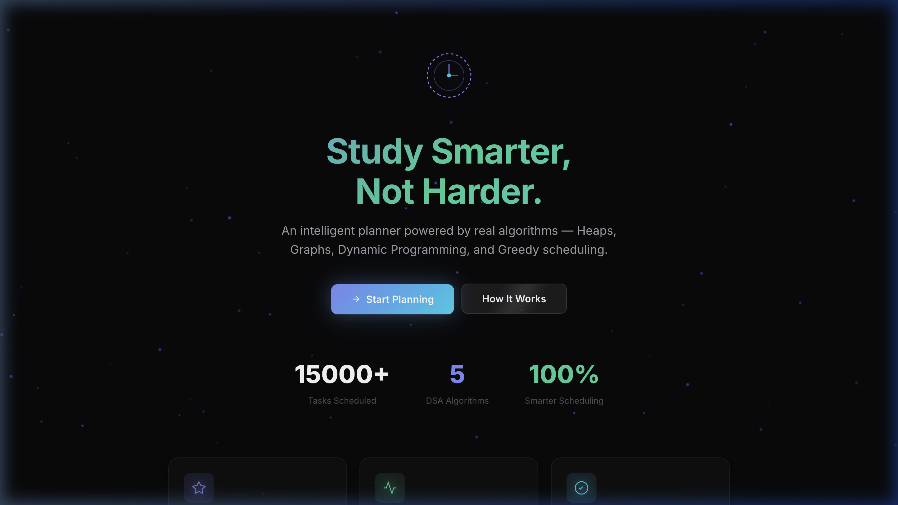
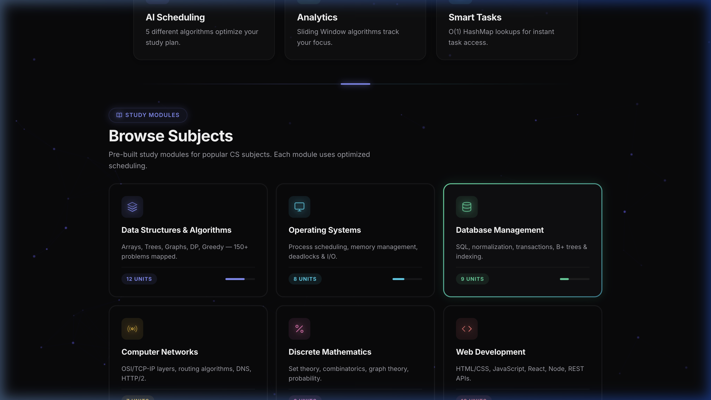

<div align="center">

# 🧠 Smart Study Planner — AI Powered

### An intelligent study planner built with real DSA algorithms, MVVM architecture, and a premium dark UI.

[](https://nodejs.org/)
[](https://expressjs.com/)
[](https://jwt.io/)
[](https://developer.mozilla.org/)
[](LICENSE)

<br/>

**[🌐 Live Demo](https://yashlanke44.github.io/Smart-Study-Planner)** · **[📄 Report Bug](https://github.com/yashlanke44/Smart-Study-Planner/issues)** · **[💡 Request Feature](https://github.com/yashlanke44/Smart-Study-Planner/issues)**

</div>

---

## 📸 Preview

<div align="center">
  
  <br/><br/>
  
</div>

---

## ✨ Key Features

| Feature | Description | Algorithm Used |
|---------|-------------|----------------|
| 🎯 **AI Schedule Generation** | Auto-generates optimal study timetables | Priority Queue (Min-Heap), DP Knapsack |
| 📊 **Real-Time Analytics** | Tracks focus hours, trends & subject distribution | Sliding Window (SMA), Canvas API |
| 🗂️ **Task Management** | O(1) CRUD operations with filters & sorting | Hash Map, Sorting Algorithms |
| 🔀 **Dependency-Aware Ordering** | Respects prerequisite chains between topics | Topological Sort (Kahn's BFS) |
| ⏰ **Deadline-Driven Scheduling** | Prioritizes tasks approaching their deadline | Greedy (Earliest Deadline First) |
| 🔍 **Time Slot Allocation** | Efficiently finds available study windows | Binary Search |
| 📈 **Productivity Suggestions** | AI-driven tips from behavior analysis | Heuristic Analysis |
| 🔐 **Secure Authentication** | JWT tokens with bcrypt password hashing | JWT + bcrypt |
| 📱 **Responsive Design** | Device selector for Mobile & Laptop views | CSS Grid + Media Queries |
| 🎨 **Premium Neon UI** | Glassmorphism, animated SVGs, particles | CSS Animations, Canvas API |

---

## 🏛️ Architecture — MVVM

```
smart-study-planner/
├── server.js                    # Express server + JWT auth
├── package.json
├── .gitignore
├── public/
│   ├── index.html               # SPA shell
│   ├── css/
│   │   ├── style.css            # Design system + layout + animations
│   │   └── components.css       # UI components + micro-interactions
│   └── js/
│       ├── app.js               # Root module — DI container
│       ├── utils.js             # Utilities (debounce, toast, confetti)
│       ├── models/
│       │   ├── TaskModel.js     # Hash Map CRUD + Observable
│       │   ├── UserModel.js     # JWT auth state
│       │   ├── SessionModel.js  # Streak & session tracking
│       │   └── SchedulerModel.js # Pure DSA algorithms
│       ├── views/
│       │   ├── AuthView.js      # Login/signup rendering
│       │   ├── TaskView.js      # Task list rendering
│       │   ├── DashboardView.js # Stats & chart rendering
│       │   ├── SchedulerView.js # Algorithm visualization
│       │   ├── AnalyticsView.js # Canvas charts
│       │   ├── SuggestionsView.js # AI tip cards
│       │   └── AboutView.js     # DSA showcase
│       └── viewmodels/
│           ├── AuthViewModel.js
│           ├── TaskViewModel.js
│           ├── DashboardViewModel.js
│           ├── SchedulerViewModel.js
│           ├── AnalyticsViewModel.js
│           └── SuggestionsViewModel.js
└── screenshots/                 # For README
```

### MVVM Data Flow
```
User Input → View → ViewModel → Model (pure logic)
                ↘               ↙
              ViewModel.notify(state)
                ↘
              View.render(state)
```

---

## 🧬 DSA Algorithms Implemented

### 1. Priority Queue (Min-Heap)
Schedules tasks by urgency score. O(log n) insert/extract. Used in the AI Scheduler for urgency-based ordering.

### 2. Topological Sort (Kahn's Algorithm)
Handles task dependencies using BFS-based topological ordering. Ensures prerequisites are completed before dependent tasks.

### 3. Greedy Algorithm (Earliest Deadline First)
Selects tasks greedily by approaching deadline. O(n log n) sort + linear scan for fast scheduling.

### 4. Dynamic Programming (0/1 Knapsack)
Maximizes task value within a time budget. Uses a 2D DP table to select the optimal subset of tasks.

### 5. Binary Search
O(log n) time slot allocation for finding the best available study window in a sorted schedule.

### 6. Sliding Window
Computes moving averages for productivity trends (7-day SMA) in the analytics module.

---

## 🚀 Getting Started

### Prerequisites
- **Node.js** v18+ ([Download](https://nodejs.org/))
- **npm** (comes with Node.js)

### Installation

```bash
# 1. Clone the repository
git clone https://github.com/yashlanke44/Smart-Study-Planner.git
cd Smart-Study-Planner

# 2. Install dependencies
npm install

# 3. Start the development server
npm start

# 4. Open in browser
# → http://localhost:3000
```

### Environment Variables (Optional)
```env
PORT=3000
JWT_SECRET=your_secret_key_here
```

---

## 🎨 Design System

| Token | Value | Usage |
|-------|-------|-------|
| `--accent-primary` | `#818cf8` (Indigo) | Primary actions, links |
| `--accent-secondary` | `#34d399` (Emerald) | Success, completed |
| `--accent-cyan` | `#22d3ee` (Cyan) | Highlights, focus |
| `--accent-warning` | `#fbbf24` (Amber) | Warnings, streaks |
| `--accent-danger` | `#f87171` (Rose) | Errors, overdue |
| `--accent-pink` | `#f472b6` (Pink) | Analytics, charts |
| `--bg-primary` | `#09090b` | Page background |
| `--font-main` | `Inter` | UI text |
| `--font-mono` | `JetBrains Mono` | Code, metrics |

---

## 📱 Study Modules

Pre-built modules for core CS subjects:

- 🔮 **Data Structures & Algorithms** — 12 units, 150+ problems
- 💻 **Operating Systems** — 8 units (scheduling, memory, I/O)
- 🗄️ **Database Management** — 9 units (SQL, normalization, B+ trees)
- 🌐 **Computer Networks** — 7 units (OSI, TCP/IP, routing)
- 📐 **Discrete Mathematics** — 6 units (sets, combinatorics, graphs)
- 🖥️ **Web Development** — 10 units (HTML/CSS, JS, React, Node)

---

## 🛡️ Security

- JWT-based stateless authentication
- bcrypt password hashing with salt rounds
- Client-side token storage with expiry validation
- CORS-protected API endpoints

---

## 🧪 Tech Stack

| Layer | Technology |
|-------|-----------|
| **Frontend** | Vanilla JS (ES6+), HTML5, CSS3 |
| **Backend** | Node.js, Express 4.x |
| **Auth** | JWT (jsonwebtoken), bcryptjs |
| **Charts** | Canvas API (custom rendering) |
| **Animations** | CSS Keyframes, SVG SMIL |
| **Architecture** | MVVM (Model-View-ViewModel) |
| **Storage** | localStorage (client-side) |

---

## 📄 License

This project is licensed under the MIT License — see the [LICENSE](LICENSE) file for details.

---

<div align="center">

**Built with ❤️ and real algorithms by [@yashlanke44](https://github.com/yashlanke44)**

*No AI-generated colors. No placeholder images. Just pure DSA-backed intelligence.*

</div>
